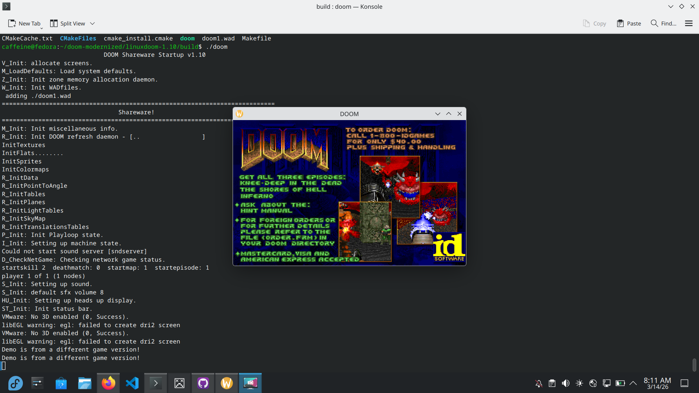

> **Note:** This is a fork of the original [id Software DOOM source release](https://github.com/id-Software/DOOM).
> The original README is preserved in [README.original](README.original).

# DOOM Modernized

> "Projects tend to rot if you leave them alone for a few years, and it takes effort for someone to deal with it again."
> — John Carmack

A port of the original id Software DOOM 1.10 source code to run on modern 64-bit Linux systems.

This is a fork of the original [id Software DOOM source release](https://github.com/id-Software/DOOM),
with fixes applied to make it compile and run on modern 64-bit Linux.



---

## What Was Changed

The original source was written for 32-bit DOS in 1993. Getting it running on
modern 64-bit Linux required fixing a number of fundamental incompatibilities:

- **Build system** — Replaced the broken DOS Makefile with a modern `CMakeLists.txt`
- **Implicit int declarations** — Fixed C89/K&R style variable declarations rejected by modern GCC
- **64-bit pointer truncation** — Fixed numerous places where pointers were cast through `int` (4 bytes on 32-bit, but 8 bytes on 64-bit), causing memory corruption
- **WAD struct alignment** — Fixed `maptexture_t` struct where a `void**` pointer field caused the on-disk WAD layout to be misread on 64-bit, corrupting all texture data
- **Hardcoded pointer-size allocations** — Replaced `Z_Malloc(n * 4)` with `Z_Malloc(n * sizeof(*ptr))` throughout
- **Stack safety** — Replaced `alloca()` calls with `malloc()` to prevent stack corruption
- **Missing DOS headers** — Replaced `errnos.h` with `errno.h`, removed conflicting `errno` variable declaration
- **SDL2 video backend** — Rewrote `i_video.c` to replace the old X11/XShm PseudoColor-only display with a modern SDL2 renderer that works on any display
- **Graceful missing patch handling** — Shareware WAD (doom1.wad) references some patches that don't exist; these are now handled with a warning instead of a fatal crash

---

## Dependencies

Install on Fedora/RHEL:
```bash
sudo dnf install gcc cmake SDL2-devel libX11-devel libXext-devel
```

Install on Ubuntu/Debian:
```bash
sudo apt install build-essential cmake libsdl2-dev libx11-dev libxext-dev
```

---

## Building
```bash
git clone https://github.com/shahwazreza/doom-modernized.git
cd doom-modernized/linuxdoom-1.10
mkdir build && cd build
cmake ..
make
```

---

## Running

You need a DOOM WAD file (game data). The shareware version (`doom1.wad`) is
freely available and works with this port.
```bash
./doom -iwad doom1.wad
```

Place the WAD file in the same directory as the binary, or pass the full path with `-iwad`.

---

## Controls

| Key | Action |
|-----|--------|
| Arrow keys | Move / Turn |
| Ctrl | Fire |
| Space | Use / Open |
| Shift | Run |
| Alt | Strafe |
| 1-7 | Select weapon |
| Escape | Menu |

---

## Known Issues

- **No sound** — The original sound server (`sndserver`) is not available on modern systems. SDL2_mixer replacement is a work in progress.
- **Shareware WAD warnings** — A few missing patch warnings are printed on startup when using `doom1.wad`. These are harmless.

---

## Status

| System | Status |
|--------|--------|
| Video | ✅ Working (SDL2) |
| Input | ✅ Working (SDL2) |
| Game logic | ✅ Working |
| Sound effects | ❌ Not yet implemented |
| Music | ❌ Not yet implemented |

---

## License

The DOOM source code is licensed under the [GPL v2](https://github.com/id-Software/DOOM/blob/master/linuxdoom-1.10/COPYING).
All modifications in this repository are made available under the same license.

---

## Acknowledgements

- [id Software](https://github.com/id-Software) for open sourcing DOOM
- [Chocolate Doom](https://github.com/chocolate-doom/chocolate-doom) for reference on clean porting approaches
- [Doom Wiki](https://doomwiki.org) for invaluable documentation on the engine internals
